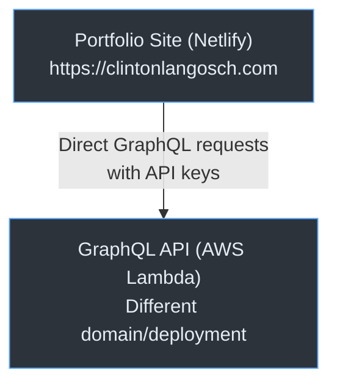
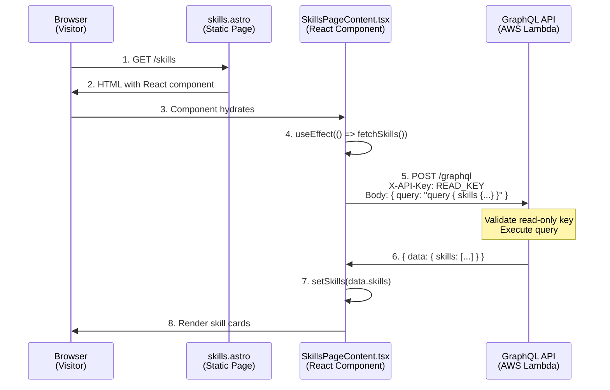
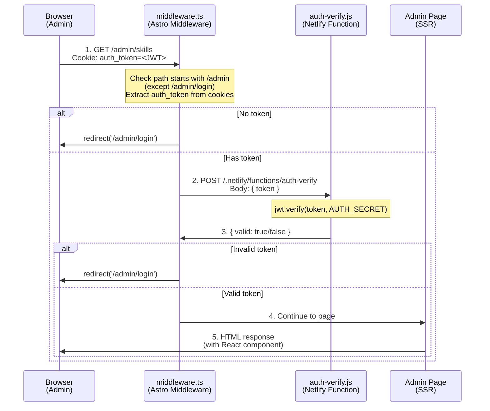
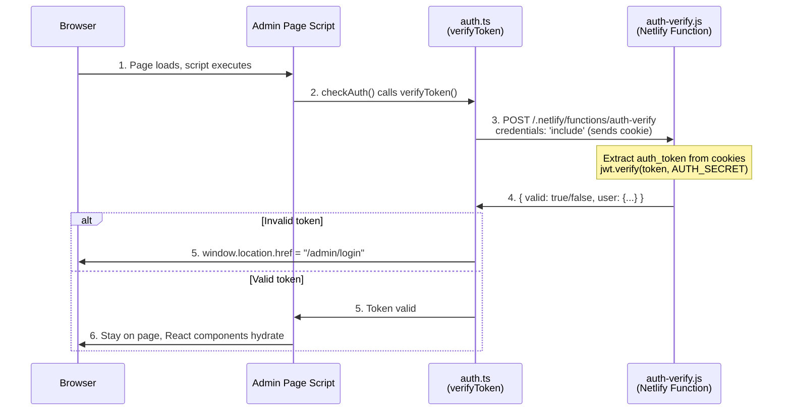
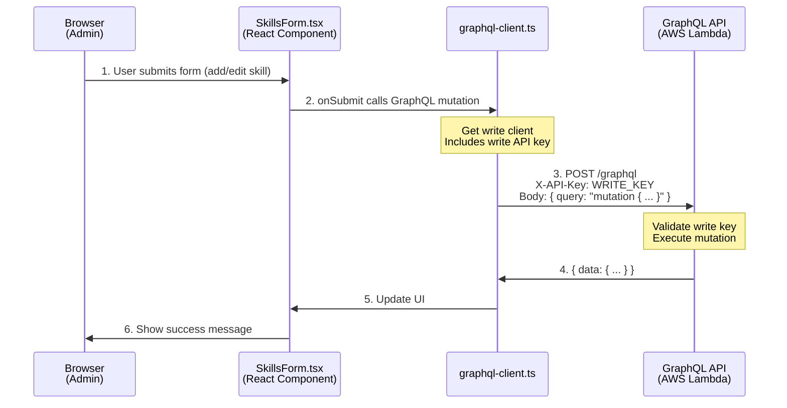

# Authentication & Request Flow Architecture

## System Overview



## Key Architecture Changes

**Previous**: GraphQL requests were proxied through a Netlify function to add authentication headers from cookies.

**Current**: Direct GraphQL API access using API key-based authentication:
- **Read-only key**: Public, safe to expose in browser, allows queries only
- **Write key**: Protected by admin middleware, allows queries and mutations

## 1. Unauthenticated Frontend Requests (Public Site)

**Flow**: Public pages → React component → GraphQL API (read-only key)



**Key Points**:
- Public pages use **React components** that fetch data at runtime
- GraphQL **queries** use read-only API key
- Read-only key is safe to expose in browser (queries only)
- No authentication required for public data

---

## 2. Admin Login Flow

**Flow**: Login form → Netlify Function → JWT cookie set

```mermaid
sequenceDiagram
    participant Browser as Browser<br/>(Admin)
    participant Form as LoginForm.tsx
    participant Login as auth-login.js<br/>(Netlify Function)
    
    Browser->>Form: 1. Navigate to /admin/login<br/>Enter username/password
    Form->>Login: 2. POST /.netlify/functions/auth-login<br/>Body: { username, password }<br/>credentials: 'include'
    
    Note over Login: 1. Validate username === ADMIN_USERNAME<br/>2. bcrypt.compare(password, ADMIN_PASSWORD_HASH)<br/>3. Generate JWT:<br/>jwt.sign({ username, iat }, AUTH_SECRET, { 24h })<br/>4. Set HTTP-only cookie:<br/>Set-Cookie: auth_token=<JWT>;<br/>HttpOnly; Secure; SameSite=Lax;<br/>Path=/; Max-Age=86400
    
    Login->>Browser: 3. Response with Set-Cookie header<br/>{ success: true, user: { username } }
    
    Note over Browser: Stores auth_token cookie<br/>(HTTP-only, can't access via JS)
    
    Browser->>Browser: 4. Redirect to /admin
```

**Security Features**:
- Password stored as bcrypt hash in `ADMIN_PASSWORD_HASH` env var
- JWT signed with `AUTH_SECRET` (64-char hex)
- Cookie is **HTTP-only** (JavaScript cannot access)
- Cookie is **Secure** in production (HTTPS only)
- Cookie is **SameSite=Lax** (CSRF protection)
- Token expires in 24 hours

---

## 3. Admin Page Access (Server-Side Auth Check)

**Flow**: Request admin page → Middleware validates cookie → Allow/Deny



**Two-Layer Auth**:
1. **Server-side** (middleware): Validates token before rendering page
2. **Client-side** (script): Additional check after page loads (see next section)

---

## 4. Client-Side Auth Check (After Page Load)

**Flow**: Page loads → Script verifies token → Stay/Redirect



**Why Two Checks?**
- **Middleware**: Prevents unauthorized page rendering (server-side)
- **Client script**: Catches expired tokens after page load (client-side)

---

## 5. Admin Data Mutations (Direct GraphQL Access)

**Flow**: React form → GraphQL API (write key)



**Key Points**:
- Admin pages use **write API key** for mutations
- Write key is protected by middleware (admin auth required)
- No proxy needed - direct API access
- Eliminates timeout issues for long-running operations (job agent)

---

## 6. GraphQL API Authentication Model

The GraphQL API validates API keys on all requests:

### All Requests (Queries + Mutations)
```
REQUIRED: X-API-Key header
- Read-only key: Allows queries only
- Write key: Allows queries and mutations
```

### Security Layers
1. **Read-only key**: Public, safe to expose, queries only
2. **Write key**: Protected by admin middleware, allows mutations
3. **Cookie auth**: Controls access to admin pages
4. **Middleware validation**: Server-side check before page render
5. **Client validation**: Client-side check after page load

---

## 7. Environment Variables

### Portfolio Site (Netlify)
```bash
# GraphQL API endpoint (public, used by client-side code)
PUBLIC_GRAPHQL_ENDPOINT=<graphql-api-url>

# Read-only API key (public, safe to expose, queries only)
PUBLIC_GRAPHQL_READ_KEY=<read-key>

# Write API key (protected by admin auth, allows mutations)
PUBLIC_GRAPHQL_WRITE_KEY=<write-key>

# Legacy env vars (for backwards compatibility with scripts)
GRAPHQL_ENDPOINT=${PUBLIC_GRAPHQL_ENDPOINT}
GRAPHQL_API_KEY=${PUBLIC_GRAPHQL_WRITE_KEY}

# Admin Auth
AUTH_SECRET=<64-char-hex>
ADMIN_USERNAME=<username>
ADMIN_PASSWORD_HASH=<bcrypt-hash>

# AI (optional)
ANTHROPIC_API_KEY=<key>
```

### GraphQL API (AWS Lambda)
```bash
# API Authentication
API_READ_KEY=<read-key>   # Must match PUBLIC_GRAPHQL_READ_KEY
API_WRITE_KEY=<write-key> # Must match PUBLIC_GRAPHQL_WRITE_KEY
```

---

## 8. Key Files Reference

### Portfolio Site
```
netlify/functions/
├── auth-login.js          # Login, set JWT cookie
├── auth-verify.js         # Verify JWT from cookie
├── auth-logout.js         # Clear cookie
└── ai-assistant.js        # Claude API proxy

src/
├── middleware.ts          # Server-side auth check
├── lib/
│   ├── auth.ts           # Client auth utilities
│   └── graphql-client.ts # GraphQL client (direct access with API keys)
└── components/
    ├── pages/            # Public page components (use read-only key)
    └── admin/            # Admin components (use write key)
```

### GraphQL API
```
src/
└── middleware/
    └── auth.ts           # API key validation
```

---

## 9. Migration from Proxy Architecture

### What Changed
- **Removed**: `netlify/functions/graphql-proxy.js` - No longer needed
- **Updated**: `src/lib/graphql-client.ts` - Now uses direct API access with keys
- **New**: API key-based authentication (read-only and write keys)

### What Stayed the Same
- Cookie-based admin authentication (middleware + JWT)
- Admin page protection via middleware
- Login/logout/verify flow unchanged
- Security model for admin access unchanged

### Benefits
- **No timeouts**: Direct API access eliminates Netlify function timeout issues
- **Simpler architecture**: One less moving part (no proxy)
- **Better performance**: Fewer network hops
- **Easier debugging**: Direct request/response flow
