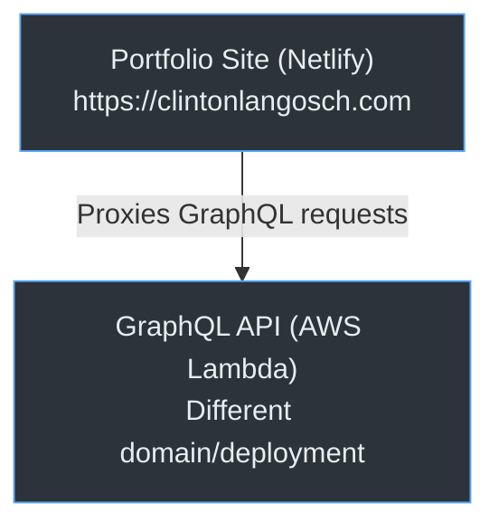
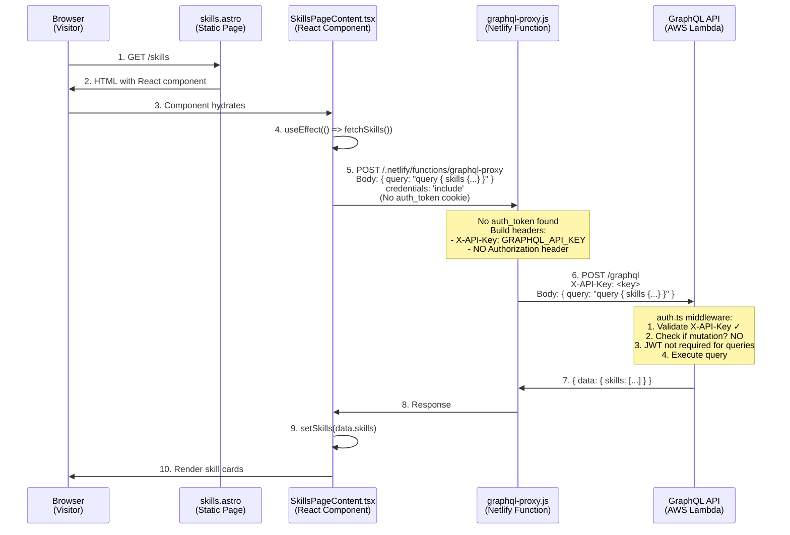
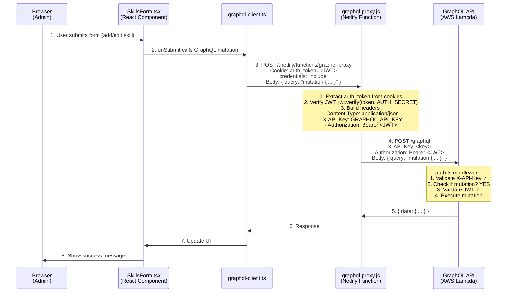
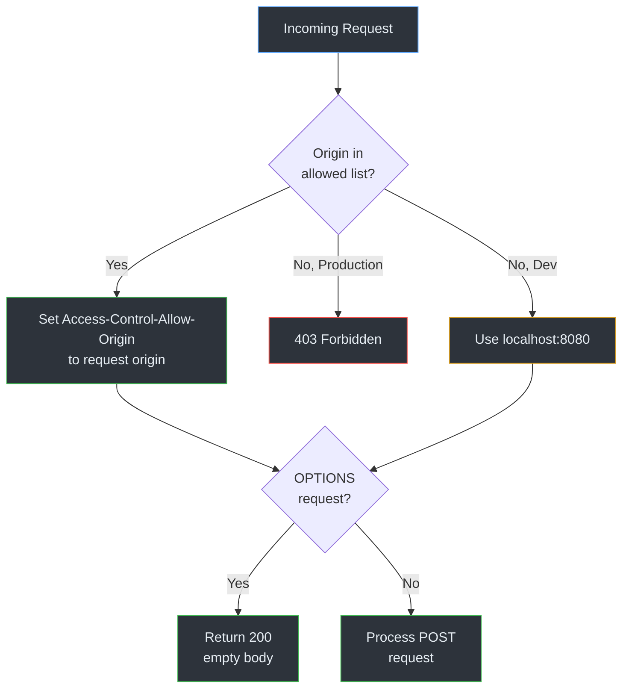
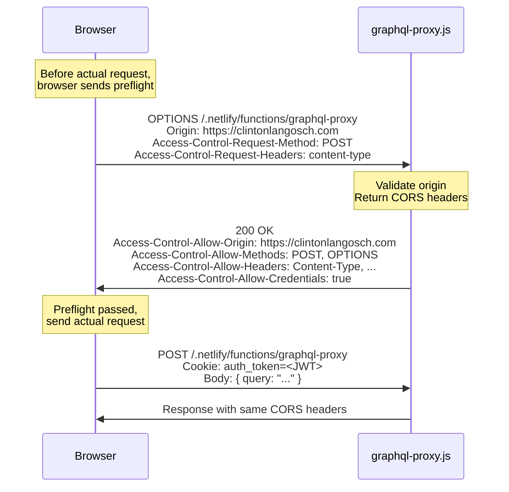
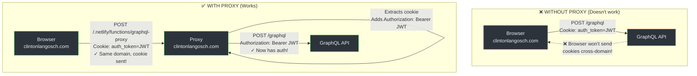

# Authentication & Request Flow Architecture

## System Overview



## 1. Unauthenticated Frontend Requests (Public Site)

**Flow**: Public pages → React component → GraphQL proxy → API (read-only)



**Key Points**:
- Public pages use **React components** that fetch data at runtime
- GraphQL **queries** (read-only) don't require JWT authentication
- Only **API key** is required (added by proxy)
- Visitors never see the API key (server-side only in proxy)
- Same GraphQL proxy used for both public and admin requests

---

## 2. Admin Login Flow

**Flow**: Login form → Netlify Function → JWT cookie set

```mermaid
sequenceDiagram
    participant Browser as Browser<br/>(Admin)
    participant Form as LoginForm.tsx
    participant Login as auth-login.js<br/>(Netlify Function)
    
    Browser->>Form: 1. Navigate to /admin/login<br/>Enter username/password
    Form->>Login: 2. POST /.netlify/functions/auth-login<br/>Body: { username, password }<br/>credentials: 'include'
    
    Note over Login: 1. Validate username === ADMIN_USERNAME<br/>2. bcrypt.compare(password, ADMIN_PASSWORD_HASH)<br/>3. Generate JWT:<br/>jwt.sign({ username, iat }, AUTH_SECRET, { 24h })<br/>4. Set HTTP-only cookie:<br/>Set-Cookie: auth_token=<JWT>;<br/>HttpOnly; Secure; SameSite=Lax;<br/>Path=/; Max-Age=86400
    
    Login->>Browser: 3. Response with Set-Cookie header<br/>{ success: true, user: { username } }
    
    Note over Browser: Stores auth_token cookie<br/>(HTTP-only, can't access via JS)
    
    Browser->>Browser: 4. Redirect to /admin
```

**Security Features**:
- Password stored as bcrypt hash in `ADMIN_PASSWORD_HASH` env var
- JWT signed with `AUTH_SECRET` (64-char hex)
- Cookie is **HTTP-only** (JavaScript cannot access)
- Cookie is **Secure** in production (HTTPS only)
- Cookie is **SameSite=Lax** (CSRF protection)
- Token expires in 24 hours

---

## 3. Admin Page Access (Server-Side Auth Check)

**Flow**: Request admin page → Middleware validates cookie → Allow/Deny


**Two-Layer Auth**:
1. **Server-side** (middleware): Validates token before rendering page
2. **Client-side** (script): Additional check after page loads (see next section)

---

## 4. Client-Side Auth Check (After Page Load)

**Flow**: Page loads → Script verifies token → Stay/Redirect


**Why Two Checks?**
- **Middleware**: Prevents unauthorized page rendering (server-side)
- **Client script**: Catches expired tokens after page load (client-side)

---

## 5. Admin Data Mutations (GraphQL via Proxy)

**Flow**: React form → GraphQL proxy → External API



---

## 6. CORS Configuration

### Why CORS Matters

The GraphQL proxy must handle CORS because:
1. Browser enforces same-origin policy for fetch requests
2. Preflight OPTIONS requests must be handled
3. Credentials (cookies) require explicit CORS headers

### Proxy CORS Headers

```javascript
// netlify/functions/graphql-proxy.js
const headers = {
  'Access-Control-Allow-Origin': allowedOrigin,  // Dynamic based on request
  'Access-Control-Allow-Headers': 'Content-Type, Authorization, X-API-Key',
  'Access-Control-Allow-Methods': 'POST, OPTIONS',
  'Access-Control-Allow-Credentials': 'true',  // Required for cookies!
};
```

### Origin Validation



**Allowed Origins**:
```javascript
const allowedOrigins = [
  'http://localhost:8080',      // Netlify Dev
  'http://localhost:4321',      // Astro direct
  'https://clintonlangosch.com', // Production
  process.env.URL,              // Deploy previews
];
```

### Critical CORS Settings

| Header | Value | Why |
|--------|-------|-----|
| `Access-Control-Allow-Credentials` | `true` | **Required** for browser to send cookies |
| `Access-Control-Allow-Origin` | Dynamic (from request) | Must match request origin when using credentials |
| `Access-Control-Allow-Headers` | `Content-Type, Authorization, X-API-Key` | Allows GraphQL headers |
| `Access-Control-Allow-Methods` | `POST, OPTIONS` | GraphQL uses POST, OPTIONS for preflight |

**Important**: When `Access-Control-Allow-Credentials: true`, you **cannot** use `Access-Control-Allow-Origin: *`. Must specify exact origin.

### Preflight Request Flow



---

## 7. Why GraphQL Proxy is Needed

**Two Problems Solved**:
1. **Cross-domain cookies** - Browsers won't send cookies to different domains
2. **CORS with credentials** - Requires same-origin or explicit CORS configuration



---

## 8. GraphQL API Authentication Rules

The external GraphQL API (`src/middleware/auth.ts`) enforces:

### All Requests (Queries + Mutations)
```
REQUIRED: X-API-Key header
- Must match API_ACCESS_KEY env var
- Returns 401 if missing/invalid
```

### Mutations Only
```
REQUIRED: Authorization: Bearer <JWT>
- JWT must be valid (signed with AUTH_SECRET)
- Returns 401 if missing/invalid
```

### Queries (Read-only)
```
OPTIONAL: Authorization header
- API key is sufficient
- JWT not required for queries
```

**Detection Logic**:
```javascript
function isMutationRequest(body) {
  const query = body.query || body.mutation || "";
  return (
    query.trim().startsWith("mutation") ||
    query.includes("mutation ") ||
    query.includes("mutation{")
  );
}
```

---

## 9. Complete Authentication Summary

### Credentials Storage
| Credential | Location | Format |
|------------|----------|--------|
| Admin password | `ADMIN_PASSWORD_HASH` env var | bcrypt hash |
| JWT secret | `AUTH_SECRET` env var | 64-char hex |
| GraphQL API key | `GRAPHQL_API_KEY` env var | String |
| GraphQL API key (API side) | `API_ACCESS_KEY` env var | String (must match) |

### Token Flow

```mermaid
flowchart LR
    Login[1. Login] --> JWT[2. JWT Generated]
    JWT --> Cookie[3. Stored in<br/>HTTP-only Cookie]
    Cookie --> Middleware[4. Middleware<br/>Validates]
    Middleware --> Mutation[5. GraphQL Mutation]
    Mutation --> Proxy[6. Proxy Extracts<br/>Cookie]
    Proxy --> Auth[7. Adds to<br/>Authorization Header]
    Auth --> API[8. API Validates<br/>API Key + JWT]
    API --> Execute[9. Executes<br/>Mutation]
    
    style Login fill:#2d333b,stroke:#58a6ff,color:#e6edf3
    style JWT fill:#2d333b,stroke:#58a6ff,color:#e6edf3
    style Cookie fill:#2d333b,stroke:#3fb950,color:#e6edf3
    style Middleware fill:#2d333b,stroke:#3fb950,color:#e6edf3
    style Mutation fill:#2d333b,stroke:#58a6ff,color:#e6edf3
    style Proxy fill:#2d333b,stroke:#58a6ff,color:#e6edf3
    style Auth fill:#2d333b,stroke:#3fb950,color:#e6edf3
    style API fill:#2d333b,stroke:#3fb950,color:#e6edf3
    style Execute fill:#2d333b,stroke:#3fb950,color:#e6edf3
```



### Security Layers
1. **HTTP-only cookie**: JavaScript cannot access token
2. **Secure flag**: HTTPS only in production
3. **SameSite=Lax**: CSRF protection
4. **JWT expiration**: 24-hour lifetime
5. **Server-side validation**: Middleware checks before rendering
6. **Client-side validation**: Script checks after page load
7. **API key**: Required for all GraphQL requests
8. **JWT for mutations**: Required for data modifications

---

## 10. Environment Variables

### Portfolio Site (Netlify)
```bash
# GraphQL API (server-side only, not exposed to client)
GRAPHQL_ENDPOINT=<graphql-api-url>
GRAPHQL_API_KEY=<api-key>

# Admin Auth
AUTH_SECRET=<64-char-hex>
ADMIN_USERNAME=<username>
ADMIN_PASSWORD_HASH=<bcrypt-hash>

# AI (optional)
ANTHROPIC_API_KEY=<key>
```

### GraphQL API (AWS Lambda)
```bash
# API Authentication
API_ACCESS_KEY=<api-key>  # Must match GRAPHQL_API_KEY above
AUTH_SECRET=<64-char-hex>  # Must match portfolio site AUTH_SECRET
```

---

## 11. Key Files Reference

### Portfolio Site
```
netlify/functions/
├── auth-login.js          # Login, set JWT cookie
├── auth-verify.js         # Verify JWT from cookie
├── auth-logout.js         # Clear cookie
└── graphql-proxy.js       # Proxy GraphQL, add auth header

src/
├── middleware.ts          # Server-side auth check
├── lib/
│   ├── auth.ts           # Client auth utilities
│   └── graphql-client.ts # GraphQL client (points to proxy)
└── components/admin/     # React admin components
```

### GraphQL API
```
src/
└── middleware/
    └── auth.ts           # API key + JWT validation
```
